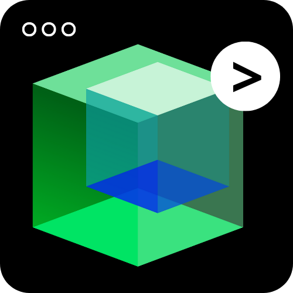
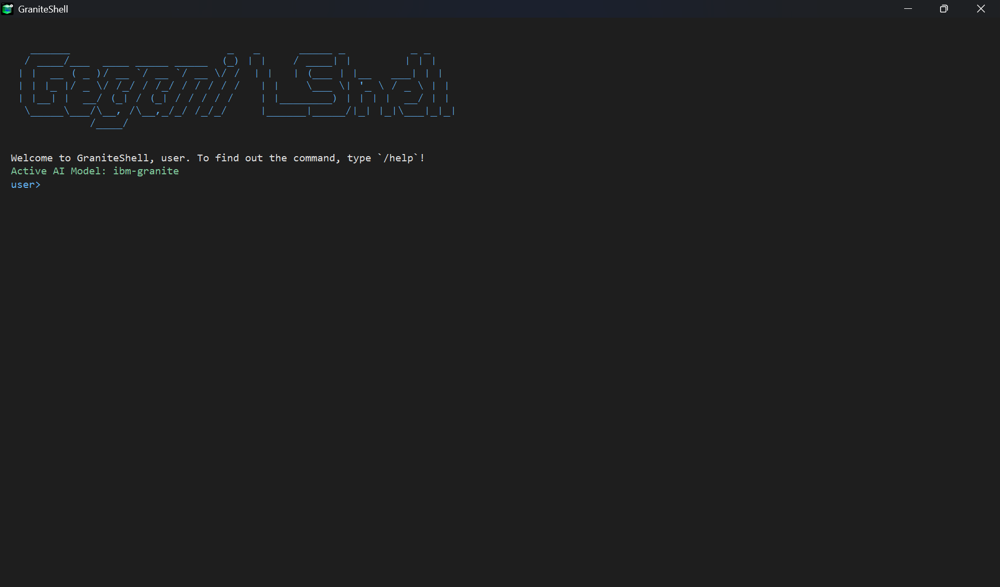

<div align="center">
  
  <h1>GraniteShell</h1>
  <p>
    <strong>A Smart Terminal Powered by AI 💡</strong>
  </p>
  <p>
    A modern terminal designed to accelerate your workflow by integrating the power of AI models directly into your command line.
  </p>
</div>

---

### **✨ Why GraniteShell?**

In modern development, constantly switching between a code editor, documentation, and the terminal can break your focus. GraniteShell is here to unify that experience, allowing you to ask questions, generate code, and get answers without ever leaving your terminal window.



### **🚀 Key Features**

* **💻 Modern Interface**: A clean, readable, and user-friendly terminal environment.
* **🤖 Integrated AI Mode**: Activate `/activate_ai` mode to interact directly with a powerful language model.
* **💾 Local Storage**: Automatically save AI outputs, including code blocks, for future reference.
* **🔧 Profile Customization**: Set your own username and storage directory to personalize your experience.
* **🌐 Multi-Model Ready**: Designed to be adaptable for various AI models in the future.

---

### **🏁 Quick Start**

It only takes 3 steps to get GraniteShell up and running:

1.  **Clone & Install**
    ```bash
    git clone [https://github.com/your-username/your-repository.git](https://github.com/your-username/your-repository.git)
    cd your-repository
    pip install -r requirements.txt
    ```

2.  **Run the Application**
    ```bash
    python main.py
    ```

3.  **Initial Setup**
    On the first run, follow the prompts to set up your username, local storage path, and your Replicate API token.

---

### **📚 Full Documentation (Wiki)**

For in-depth guides, a complete command list, configuration details, and other technical information, please visit the **[GraniteShell Project Wiki](https://github.com/your-username/your-repository/wiki)**.

---
